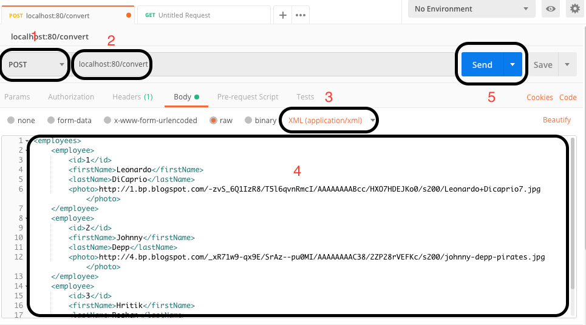

# Simple service for converting given XML to YAML
## Example
### Documentation
Check out docs from /docs folder
### Request example
```
POST convert/
HEADERS:
Content-Type: application/xml
BODY:
<employees>
	<employee>
		<id>1</id>
		<firstName>Leonardo</firstName>
		<lastName>DiCaprio</lastName>
		<photo>http://1.bp.blogspot.com/-zvS_6Q1IzR8/T5l6qvnRmcI/AAAAAAAABcc/HXO7HDEJKo0/s200/Leonardo+Dicaprio7.jpg</photo>
	</employee>
	<employee>
		<id>2</id>
		<firstName>Johnny</firstName>
		<lastName>Depp</lastName>
		<photo>http://4.bp.blogspot.com/_xR71w9-qx9E/SrAz--pu0MI/AAAAAAAAC38/2ZP28rVEFKc/s200/johnny-depp-pirates.jpg</photo>
	</employee>
	<employee>
		<id>3</id>
		<firstName>Hritik</firstName>
		<lastName>Roshan</lastName>
		<photo>http://thewallmachine.com/files/1411921557.jpg</photo>
	</employee>
</employees>
```
### Response example
```
STATUS: 200 OK
HEADERS:
Content-Length: 486
Date: Sun, 16 Dec 2018 15:39:37 GMT
Connection: Keep-Alive
Keep-Alive: timeout=60
BODY:
employees: 
 employee:
  -
   firstName: Leonardo
   photo: http://1.bp.blogspot.com/-zvS_6Q1IzR8/T5l6qvnRmcI/AAAAAAAABcc/HXO7HDEJKo0/s200/Leonardo+Dicaprio7.jpg
   id: 1
   lastName: DiCaprio
  -
   firstName: Johnny
   photo: http://4.bp.blogspot.com/_xR71w9-qx9E/SrAz--pu0MI/AAAAAAAAC38/2ZP28rVEFKc/s200/johnny-depp-pirates.jpg
   id: 2
   lastName: Depp
  -
   firstName: Hritik
   photo: http://thewallmachine.com/files/1411921557.jpg
   id: 3
   lastName: Roshan
```
## How to start the server
1. Download sources
   1. Clone repository via git:
   ```
   git clone https://github.com/radleweird/pe_task
   ```
   2. Or download .zip:
   ```
   https://github.com/radleweird/pe_task/archive/master.zip
   ```
2. Change current directory to project directory from terminal:
```
cd pe_task
```
3. Generate Dockerfile and create Docker image:
```
./gradlew serverDocker
```
4. (Optionally) You can verify created Dockerfile from step 3:
```
cat build/docker/Dockerfile
```
5. Start the server with shell script:
```
./run
```
6. Wait a minute, occasionally Swift Package Manager rebuild project while starting
7. To stop the server get container id with ```docker ps``` and kill container with ```docker kill id```
## How to use
1. Download Postman from ```https://www.getpostman.com/```
2. Configure POST request
   1. Choose the POST method
   2. Enter ```localhost:80/convert```, replace ```localhost``` with ip address of your machine where server working on
   3. Set content type to ```application/xml``` within **Body** request settings
   4. Paste your XML data
   5. Push the **Send** button

